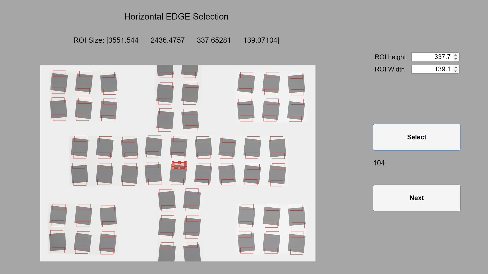
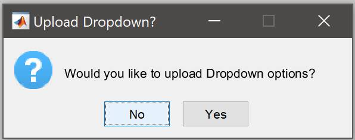

# A Tool for Deriving Camera Spatial Frequency Response from Natural Scenes (NS-SFR)
By Oliver van Zwanenberg, Sophie Triantaphillidou and Robin B. Jenkin

School of Computer Science and Engineering, The University of Westminster, UK 

## Introduction
The Natural Scene derived Spatial Frequency Response (NS-SFR) framework automatically extracts suitable step-edges from natural pictorial scenes and processes these edges via the slanted edge algorithm. This data is then used to estimate the system e-SFR (ISO12233:2017 [1]). This prototyped self-executable interface provides optimised software to implement this methodology. 

Alongside this self-executable, several MATLAB tools are also provided that will assist with NS-SFRs and estimated e-SFRs from natural scenes. A manual ROI selection GUI is provided for test chart comparisons. In addition, two scene classification tools are provided. The first is an automated method, based on a retrained AlexNet, which labels images based on their general environment (Man-made, Indoor or Nature). The second is a manual method of scene classification, using a GUI to cycle through a dataset of images, allowing you to label the main light source, the primary image subject and the general environment (Man-made, Indoor or Nature). 
For detail on this proposed workflow, please see:

O. van Zwanenberg, S. Triantaphillidou, and R. B. Jenkin, “A Tool for Deriving Camera Spatial Frequency Response from Natural Scenes (NS-SFR)” IS&T International Symposium on Electronic Imaging: Image Quality and System Performance XX, 2023. – [DOI:10.2352/EI.2023.35.8.IQSP-311](https://library.imaging.org/ei/articles/35/8/IQSP-311)

O. van Zwanenberg, S. Triantaphillidou, R. B. Jenkin, and A. Psarrou, “Estimation of ISO12233 Edge Spatial Frequency Response from Natural Scene Derived Step-Edge Data” Journal of Imaging Science and Technology (JIST), Volume 65, Number 6, November 2021, pp. 60402-1-60402-16(16). https://doi.org/10.2352/J.ImagingSci.Technol.2021.65.6.060402 

O. van Zwanenberg, S. Triantaphillidou, R. B. Jenkin, and A. Psarrou, “Analysis of Natural Scene Derived Spatial Frequency Responses for Estimating Camera ISO12233 Slanted-Edge Performance” Journal of Imaging Science and Technology (JIST), Volume 65, Number 6, November 2021, pp. 60405-1-60405-12(12). https://doi.org/10.2352/J.ImagingSci.Technol.2021.65.6.060405 

O. van Zwanenberg, S. Triantaphillidou, R. B. Jenkin, and A. Psarrou, “Natural Scene Derived Camera Edge Spatial Frequency Response for Autonomous Vision Systems” IS&T/IoP London Imaging Meeting, 2021. https://doi.org/10.2352/issn.2694-118X.2021.LIM-88 

O. van Zwanenberg, S. Triantaphillidou, R. B. Jenkin, and A. Psarrou, “Camera System Performance Derived from Natural Scenes” IS&T International Symposium on Electronic Imaging: Image Quality and System Performance XVII: Displaying, Processing, Hardcopy, and Applications, 2020. https://doi.org/10.2352/ISSN.2470-1173.2020.9.IQSP-241 

O. van Zwanenberg, S. Triantaphillidou, R. B. Jenkin, and A. Psarrou, “Edge Detection Techniques for Quantifying Spatial Imaging System Performance and Image Quality”, IEEE: New Trends in Image Restoration and Enhancement (NTIRE) workshop, in conjunction with Conference on Computer Vision and Pattern Recognition (CVPR), 2019. https://doi.org/10.1109/CVPRW.2019.00238 

**PhD Thesis:**

O. van Zwanenberg, “Camera Spatial Frequency Response Derived from Pictorial Natural Scenes,” University of Westminster, 2022. https://doi.org/10.34737/vvqxq 
## Self-Executable User-Interface Prototype
### Updates September 2023
+ Fix to reported bugs in the code
+ Updated to use sframt5, instead of sfrmat4 [^3]
+ Allow JPEG and PNG file formats to be uploaded, in addition to the RAW and TIFF

### 1. Measurement

You will be presented with the Measurement tab when opening the guided user interface (GUI). In this tab, the methodology parameters are set, and the image dataset’s directory and the directory where the data will be saved are selected. 
  
 Figure 1 – The Measurement Tab of the GUI 
  
**Parameters:**

+ Contrast Range – the range of Michelson contrast values that are selected for the e-SFR estimation. The default values are 0.55 to 0.65 (a range recommended by the standard ISO12233:2017 [^1] ). 
+ Angle Range – the edge angle range selected for the e-SFR estimation. The default range is 2.5 to 42.5 degrees. The recommended value is 5 degrees; however, this would significantly reduce the quantity of step-edges isolated from natural scenes.
+ Edge Length – the minimum and maximum height of the Region of Interest (ROI). If too short, there will be error in the e-SFR measurement, but if it is too tall, the ROI is more likely to contain unwanted natural scene artifacts, depth of field changes and other intersecting edges. The default range is between 20 to 128 pixels. 
+ Number of Radial Annuli – The number of radial rings the field of view is divided into. The more segmentations, the more e-SFR estimations will be made across the frame. However, the results would reduce accuracy if there is not a sufficient number of edges across the image dataset. For this optimised workflow, it is recommended to use 3 radial annuli. The radiuses are set by distributing the segmented frame area equally across the annuli, providing an equal probability for each annulus to contain a similar number of edges for the e-SFR estimation.

**Camera System Information:**

+ Pixel pitch – The pixel pitch of the camera used to capture the dataset. 
+ *f* /number – The *f* /number of the lens used to capture the dataset. 

Pixel pitch and the *f* /number are used to model the MTF, combining a modelled diffraction-limited lens (at a wavelength of 550nm) and a modelled pixel MTF response based on a sinc function [^2]. This model is used to determine the proximity that two ESFs have to be before they overlap, i.e., the minimum distance two neighbouring edges can be isolated. 

**Average Global e-SFR Estimation Weights:**

The global estimated e-SFR is calculated using a weighted median of the NS-SFRs from each radial annuli. These weights dictate which portions of the frame are given more emphasis and should be set depending on your application. The default is 1.00 for the centre, 0.75 for the part-way regions and 0.50 for the corners of the frame. The ‘centre’, ‘part-way’ and ‘corners’ are distributed equally across the set number of radial annuli; for example, for 6 annuli, the centre would refer to the centre two annuli, the part-way the two mid annuli and the outer two annuli would be the corners. If using fewer than two radial annuli, set all weights to 1 (no weighting). 

**Computation Settings**

Number of CPU Cores – This setting allows you to dictate how much of the available CPU is used. The default would be the maximum number of cores. If fewer cores are used, the processing will be slower, but it allows you to run some low-computation tasks while processing. 

**Image File Type**

This setting refers to your dataset. Either choose TIFF for demosaiced images or RAW for mosaiced sensor images. If you are using another demosaiced format, use another software to convert the files to .tif uncompressed (future versions of this software will accept other image formats). There are several manufacturer-specific RAW formats. Convert your RAW images to DNG 1.3 files using Adobe DNG Converter (Figure 2). 
  
 Figure 2 – Adobe DNG Converter preference settings. 
  
If RAW files are selected, check your camera system’s Bayer pattern orientation and adjust the GUI Bayer pattern drop-down accordingly. The default is RGGB. 

**Select Dataset**

Clicking this button will open a popup window to browse and select the directory where the dataset is held. Once selected, if the images are successfully found, the light will turn white, and the number of images will be displayed (Figure 3). 
  
   Figure 3 – white light indicating that the images were found, with the number of images displayed underneath.  
  
**Save Data**

This button works in the same way as Select Dataset. Select the directory to save the data, and ensure there is plenty of disk space for the data to save correctly.

**Action**

Action is the workflow you would like to perform. There are two options: 
+ Estimate the system e-SFR – This will run the optimised workflow to extract natural scene step edges and estimate the system e-SFR.
+ Measure NS-SFRs – This action will perform the unoptimised workflow, which extracts greater numbers of natural scene step-edges to measure only the NS-SFRs. Such data would be used for studies of natural scenes, non-linear image signal processing (ISP) and scene-dependent performance. If this option is selected, the thresholds that will no longer be used will become greyed out. Also, if you have RAW files selected, you will be given the option to choose the colour channel from which the NS-SFRs will be extracted; the default is 2 (equivalent to the first green channel RGGB). 

Once all set, pressing Start will begin the processing. 

### 2. Processing
Once processing starts, you will be automatically taken to the Processing tab. The messages displayed will depend upon the action that was selected. 

There are two parts to the action ‘Estimate the system e-SFR’. Part 1 will take the most time. The first message will be “Initialising…”, setting up the CPU cores, and then “Processing...” (Figure 4). A progress bar will appear as a popup window, providing an approximate completion time. 

Part 1 is the extraction and verification of pictorial natural scene step-edges, which then pass the e-SFR algorithm to produce NS-SFRs. Burns’ sfrmat5 code [^3] was adapted for this purpose. The software will output MATLAB .m data files to the directory selected to save the data. These files contain the NS-SFRs and data used for the e-SFR estimation. 

Once Part 1 is completed, Part 2 will be highlighted, and the processing will begin. This second stage should not take as long to complete, calculating the system e-SFR estimates across the radial annuli and a global weighted average. The output is one MATLAB .m file containing the system e-SFR estimation.
  
   Figure 4 – The Processing Tab displayed when using the action ‘Estimate the system e-SFR’.  
  
The action ‘Measure NS-SFRs’ is not computationally optimised and thus may take longer than the ‘Estimate the system e-SFR’ action. However, it provides many more NS-SFRs per pictorial image, without edge angle and contrast range limits. Figure 5 is a screen capture of the processing tab for the ‘Measure NS-SFRs’ action. A progress bar will appear as a popup window, providing an approximate completion time.

The NS-SFRs per image will be saved as a .xlsx file, named identically to the image file from which it was extracted. This .xlsx file contains the edge contrast, edge angle, image coordinates*, the measured NS-SFR and resampled LSF for each natural scene step-edge extracted. 

Once completed, you can close this application and analyse the results in the software of your choice. 

 *Coordinates: (x, y) locating the top left ROI corner and then the width and height of the ROI. Note: to locate the ROIs for the vertical NS-SFRs, the image must be rotated 90 degrees counterclockwise. 
  

   Figure 5 – The Processing Tab displayed when using the action ‘Measure NS-SFRs’. 
  
### 3. Load Data
If the ‘Estimate the system e-SFR’ action has already been completed, you can re-load the results to visualise in this application. Go to the Load Data tab (Figure 6) and locate the directory in which the data is saved.
  
   Figure 6 – Load Data Tab. 
  
### 4. Data
Once the ‘Estimate the system e-SFR’ action or the Load e-SFR Estimation data has been completed, you will be brought to the Data tab (Figure 7). There are two additional tabbed pages on this page, ‘Vertical e-SFR Estimation’ and ‘Horizontal e-SFR Estimation’, where the vertical and horizontal estimated e-SFR will be plotted. By default, the weighted global average is displayed. To see the estimates across the frame, uncheck ‘Weighted Average’ and cycle between the radial annuli. 

Checking ‘Plot Modeled MTF’ will plot the modelled MTF that was used to determine the minimum distance between ESFs. 

Pressing “Load Test Chart Vertical/Horizontal e-SFR Data” will open up a window for you to select the directory to a .xlsx file that contains the equivalent ISO12233 lab-based measured e-SFR for accuracy comparisons. This .xlsx file must follow the specified structure; please see the ISO12233 Test Chart Data section below. 

To save the plotted data, press the Microsoft Excel icon in the bottom right-hand corner and select the directory to save the data .xlsx file. This will save the estimated system e-SFR data but only include the Modeled MTF and test chart data in the file if they are first selected within the GUI. Note, this should be done for the Vertical and Horizontal e-SFR Data in their separate tabs, creating two .xlsx files. 
  
   Figure 7 – Data Tab. 
  
## ISO12233 Test Chart Data
The data must be in a specific layout to load the comparison test chart data into the GUI. Each Radial Anuli should be contained on a separate sheet, plus an additional sheet for the global average. For example, For three radial annuli, there need to be four sheets, Sheet 1 to Sheet 3 are the three radial annuli, and Sheet 4 contains the global average. On each sheet, the layout is as follows (also displayed in Figure 8):
+ A2:A52 – should contain the spatial frequency, ranging from 0 to 0.5 cyc/pixel in 0.01 increments. 
+ B2:B52 – Should contain the average e-SFR for the radial annuli.
+ Subsequent columns should contain the individual e-SFRs from the ROIs contained in the radial annuli. 
  
   Figure 8 – .xlsx file layout for ISO12233 e-SFR Test Chart data 
  
A MATLAB script ( *ManualROISelection.m* ) is provided in the same GitHub repository as the e-SFR estimation GUI. This script allows you to select ROIs from test chart image(s) and processes them into the correct .xlsx format (as described above). 

To run this script, it requires: 
+ MATLAB
+ Image Processing Toolbox
+ Statistics and Machine Learning Toolbox

To use *ManualROISelection.m* , first capture test chart images using your test camera system. It is advised to follow the ISO12233:2017 guidelines to capture these images. You can either use a large test chart with many edges covering the entire field of view or take multiple captures, moving the test chart around to cover the entire frame. 

Set the number of Radial Annuli (RA) in *ManualROISelection.m* , found on line 9, to the same number of Radial Annuli set in the e-SFR estimation GUI. 

When running the code, you will be first asked if the images are RAW (.dng) or TIFF (.tif) files (i.e., mosaiced sensor images or demosaiced images). Select the appropriate option (Figure 9). 
  
   Figure 9 – Pop-up window to select the file type of the test chart images.  
  
You then will be asked to find and select the directory where the test chart image(s) are stored. You must store the captured test chart image(s) in a unique folder; in other words, store test chart captures from a single camera system together, whether that is only one image or several images moving the test chart across the frame. 

After selecting the directory, MATLAB will read the images. Once the images are opened in MATLAB, a GUI will open (Figure 10), presenting the first test chart image. Manually move the red ROI selector to surround a HORIZONTAL step-edge, and then press select. A red outline will be displayed around each selection. Continue to select all horizontal ROIs in the image, and then press next. If there are multiple captures of the test chart, the GUI will display the next image, where you will need to continue to select all horizontal ROIs. After the horizontal ROI selection process on all images in the directory, the first image will be displayed again to select all vertical ROIs. Continue to select vertical ROIs through all images. 

  
   Figure 10 – ROI Selection GUI 
  
The e-SFRs will be calculated using Burns’ *sfrmat5* code [^3]. 
After completing the selection process, push next one last time, the GUI will close, and you will be asked to select a directory to save the data. A MAT file will be saved containing all data ( *eSFR_Estimation.mat* ), and either two or six .xlsx files will be saved. If TIFF images were used, two .xlsx files are saved ( *ISO12233eSFR_Horizontal.xlsx* and *ISO12233eSFR_Vertical.xlsx* ). If RAW image test chart captures were used, there would be three .xlsx files for each orientation, providing the e-SFRs for each mosaiced colour channel (R, G and B). 

Future iterations of the e-SFR estimation GUI should have this test chart ROI selection tool built-in. 

If you desire to recalculate the ISO12233 e-SFRs with a different number of radial annuli, rather than reselecting all the ROIs a second time, load the *eSFR_Estimation.mat* file into MATLAB and run 
*TransferSFRtoExcel.m* . The RA can be changed on line 20 of this code.

## Scene Classification
In this GitHub repository, there are two means of scene classification. An automated method and a manual method. The automated method is faster than the manual method but is less accurate and provides less information about each image.

### Automated Scene Classification
The AlexNet CNN [^4] is a well-known and widely used network for object classification. Using a large number of categories was not a requirement for this project. Instead, the aim was to classify scenes according to the general environment. Three categories were selected for this purpose: 
i) Man-made exteriors, urban or rural that include built structures. 
ii) Indoor scenes, including interiors of shelters, homes, and public buildings. 
iii) Nature scenes, which include landscapes, plants, and animals. 

A transfer learning process was applied to AlexNet. Rather than retraining all 25 layers of the CNN, only the last three layers were retrained, the Fully Connected, Softmax and Classification Output layers. This adjusted Alexnet is provided in the SCNet.mat file. 

In MATLAB, first load(‘ *SCNet.mat* ’), and open an image in MATLAB, resize it to [227 227]pixels, and then run *[category, score] = trainedNet.classify(image)* . category provides the Man-made, Indoor or Nature scene class, and the score provides the certainty of the classification. 

The code in *SceneClassDatabase.m* , uses this scene classifying CNN to provide a Man-made/Indoor/Nature percentage split of an image dataset. 

### Manual Scene Classification
Depending on the required use case, a manual scene classification may provide both more data and better accuracy than the CNN scene classification. The MATLAB code *imSortGUI.m* launches a GUI (Figure 11) for this purpose. The GUI will allow you to cycle through a dataset of images, labelling the main light source, the primary image subject and the general environment (Man-made, Indoor or Nature). 
  
   Figure 11 – imSort GUI to manually label a dataset of images. 
  
This is a very time-consuming task and, thus, has been programmed to allow you to work on it in sections. When you run *imSortGUI.m*  it will first ask if you want to ‘continue and load previous imSort’ or ‘start a new dataset’ (Figure 12). It is recommended to move 10 images into a directory and imSort those. Then, replace these images with another set of 10 images and continue in this manner, building up the dataset scene classification data. To ‘continue and load previous imSort’, you need to select the directory you have stored the last imSort data. 
  
   Figure 12 – *imSortGUI.m* popup window gives the option to continue building a previous imSort or start a new dataset. 
  
If you answered ‘start a new dataset’, a pop-up will then ask whether you want to upload dropdown options (Figure 13). This is to upload a file called *Dropdowns.mat* that contains the dropdown names used for another dataset, i.e., if using imSort on many different datasets, you do not need to keep typing in your specific lighting/location names.
 
   Figure 13 – *imSortGUI.m* pop-up window gives the option to upload previously used dropdown names. 
  
Next, you will need to state if the images are RAW (.dng) files or TIFF (.tif) files (Figure 14), and then select the directory of the dataset. The GUI will then open, displaying the first image. Select the general environment (Man-made, Indoor or Nature). Then type in the main light source and the primary image subject if the correct label is not in the dropdown. Pressing next will add any new labels to the dropdown options. Only select ‘Other’ from the dropdown to type in a new label. 
  
   Figure 14 – *imSortGUI.m* window that indicates if the dataset contains RAW or TIFF images. 
  
Once you finish the set of images, you will be asked to save and select a directory. A .xlsx file will be saved containing three sheets. The first will be a list of image filenames with labels. The second sheet contains the total distribution of the primary image subject and the distribution of primary subjects across Man-made, Indoor and Nature. The third sheet contains the total distribution of the main light source and the distribution of the main light source across Man-made, Indoor and Nature.

## References
[^1]: British Standard Institute, “BS ISO 12233:2017 Photography - Electronic still picture imaging -Resolution and spatial frequency responses,” BSI Standards Publication, pp. 1–62, 2017.
[^2]: R. Jenkin and P. Kane, “Fundamental Imaging System Analysis for Autonomous Vehicles,” in Autonomous Vehicles and Machines Conference, 2018, vol. 2018, no. 17, pp. 105-1-105–10, doi: 10.2352/issn.2470-1173.2018.17.avm-105.
[^3]: P. D. Burns, “sfrmat5 source code,” Burns Digital Imaging, 2023. http://burnsdigitalimaging.com/software/sfrmat/ (accessed Sep. 17, 2023).
[^4]: A. Krizhevsky, I. Sutskever, and G. E. Hinton, “ImageNet Classification with Deep Convolutional Neural Networks,” Advances in neural information processing systems, vol. 1, pp. 1097–1105, 2012.
